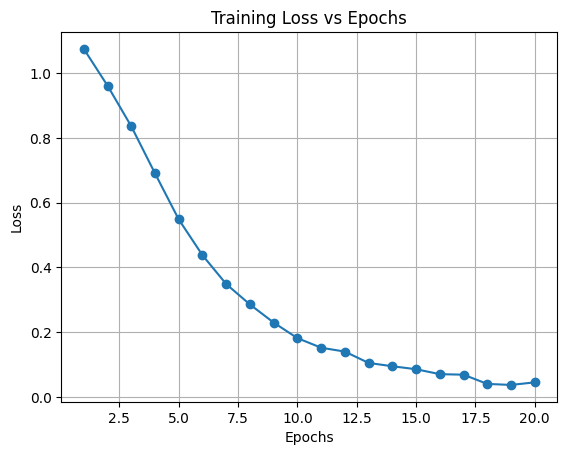
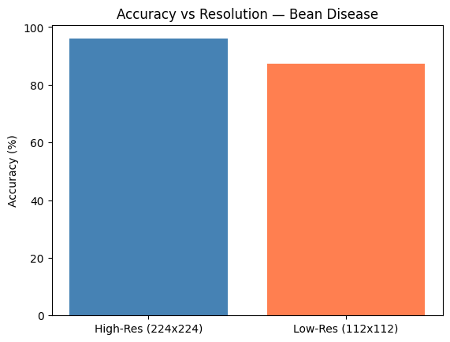

# Cross-Resolution Consistency Learning for Bean Disease Classification

## What This Project Does
Bean diseases cause huge crop losses. Farmers photograph their crops 
with different phones — some high quality, some low quality (blurry/compressed).
A model trained only on sharp images fails on low-quality ones.

So we trained a model that works well on BOTH high and low resolution images
by teaching it to give consistent predictions regardless of image quality.

---

## Dataset Used

### Training Dataset — Bean Disease Dataset (Kaggle)
- Link: https://www.kaggle.com/datasets/therealoise/bean-disease-dataset
- 3 classes:
  - Angular Leaf Spot
  - Bean Rust
  - Healthy
- No pre-made train/val split — we did 80/20 split manually

### Unseen Test Dataset — Bean Health and Disease Dataset (Mendeley)
- Link: https://data.mendeley.com/datasets/3km9d246z2/3
- Collected in Bangladesh (different environment, camera, lighting)
- We only used 2 matching classes:
  - Bacterial Pathogen → maps to Angular Leaf Spot
  - No Disease → maps to Healthy
- 837 test images — model had NEVER seen these before

---

## Model
- **ResNet18** — a standard deep CNN with residual connections
- Loaded with **ImageNet pretrained weights** (already knows edges, textures, colors)
- Final layer changed to output **3 classes** instead of 1000

### Why ResNet18?
- Lightweight and fast to train
- Pretrained weights transfer well to real-world photos
- Proven to work well on image classification tasks

---

## How It Works — Step by Step

### Step 1 — Multi Resolution Input
For every single image, we create TWO versions:
- High resolution → 224×224 pixels (clear image)
- Low resolution → 112×112 pixels (compressed/blurry image)

Both versions show the same leaf, just at different qualities.

### Step 2 — Pass Both Through Same Model
Both the high-res and low-res versions are passed through 
the same ResNet18 model, giving us two sets of predictions.

### Step 3 — Two Losses Combined
We use two loss functions together:

**Loss 1 — Classification Loss (CrossEntropy)**
- Makes sure the model predicts the CORRECT disease class
- Standard loss used in all classification models

**Loss 2 — Consistency Loss (KL Divergence)**
- Measures how DIFFERENT the predictions are for high-res vs low-res
- If predictions are different → high penalty
- If predictions are same → low penalty
- This forces the model to be resolution-robust

**Final Loss = Classification Loss + 0.5 × Consistency Loss**

---

## Training Journey

### Attempt 1 — 10 Epochs
- Result on unseen data: 0.24%
- Problem: Model had not learned enough yet

### Attempt 2 — 20 Epochs
- Result on unseen data: 64.28%
- Sweet spot — model learned well without overfitting

### Attempt 3 — 30 Epochs
- Result on unseen data: 24.61%
- Problem: Overfitting — model memorized training data
- Performed WORSE on unseen data

### Conclusion — 20 Epochs was the best

---

## Final Results

| Metric | Value |
|--------|-------|
| High-Res Validation Accuracy (224×224) | 95.96% |
| Low-Res Validation Accuracy (112×112) | 87.37% |
| Unseen Dataset Accuracy (Mendeley) | 64.28% |
| Best Epochs | 20 |
| Optimizer | Adam (lr=0.00005) |
| Test Samples | 837 |

---

## Graphs

### Training Loss vs Epochs

- Shows loss decreasing over 20 epochs
- Proves the model is learning with each epoch
- Loss starts high and steadily drops — expected healthy training behavior

### Accuracy vs Resolution

- Compares High-Res (224×224) vs Low-Res (112×112) accuracy
- High-Res Accuracy: 95.96%
- Low-Res Accuracy: 87.37%
- Small gap of ~8.5% proves the Consistency Loss worked
- Without consistency training, this gap would be much larger

---

## Why Unseen Accuracy is Lower (Domain Gap)
The Mendeley dataset was collected in Bangladesh with different:
- Cameras
- Lighting conditions
- Backgrounds
- Leaf angles

This is called a **Domain Gap** — the model was trained in one 
environment and tested in a completely different one.
64.28% despite this gap shows the model genuinely learned 
disease features, not just memorized training images.

---

## How to Run This Project

### Step 1 — Open Notebook
Open Project.ipynb in Google Colab

### Step 2 — Download Training Dataset
- Go to: https://www.kaggle.com/datasets/therealoise/bean-disease-dataset
- Download and upload zip to Colab
- Run Cell 3 to unzip

### Step 3 — Download Test Dataset
- Go to: https://data.mendeley.com/datasets/3km9d246z2/3
- Download: beans-20251022T043712Z-1-001.zip (152 MB)
- Upload to Colab and run Cell 17 to unzip

### Step 4 — Run All Cells in Order
Cells 1 → 19, training happens in Cell 13 (20 epochs)

---

## Tech Stack
- Python
- PyTorch
- Torchvision
- TIMM
- Matplotlib
- Google Colab (T4 GPU)

---

## Files in This Repo
- `Project.ipynb` — Full code with comments
- `graph1.png` — Training Loss vs Epochs
- `graph2.png` — Accuracy vs Resolution (High-Res vs Low-Res)
